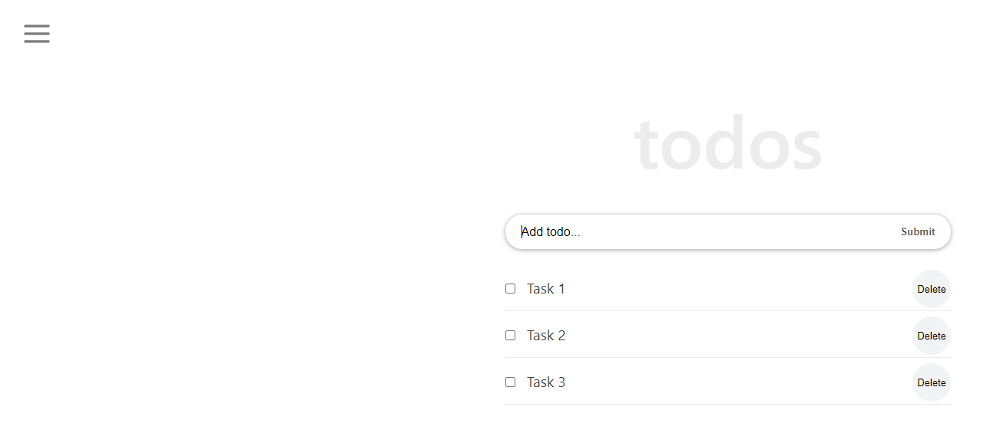

<!-- # Getting Started with Create React App -->
# TODO list in React
## This is a SPA todo-list, helps to organize tasks. You can easily add, delete and edit todos. Also, there is the possibility to mark tasks as completed. Local storage will keep your task on the list after refreshing and either close/open the browser.

## Check deployed [demo](https://elmar8287.github.io/react-tuto/).

# Built With
- ReactJS
- JS 
- CSS
- Node.js 

# Getting Started

## Setup
- git clone https://github.com/elmar8287/react-tuto.git
- cd ./react-math

## Install
npm install

## Usage
npm start

## Build
npm run build

## Run tests
npm test

## Author

👤 **Elmar Abdulkarimov**

- GitHub: [@elmar8287](https://github.com/elmar8287)

## 🤝 Contributing

Contributions, issues, and feature requests are welcome!

Feel free to check the [issues page](../../issues/).

## Show your support

Give a ⭐️ if you like this project!

## Acknowledgments

The project personalized for my  purposes. See the MIT.md file

## 📝 License

This project is [MIT](./MIT.md) licensed.
